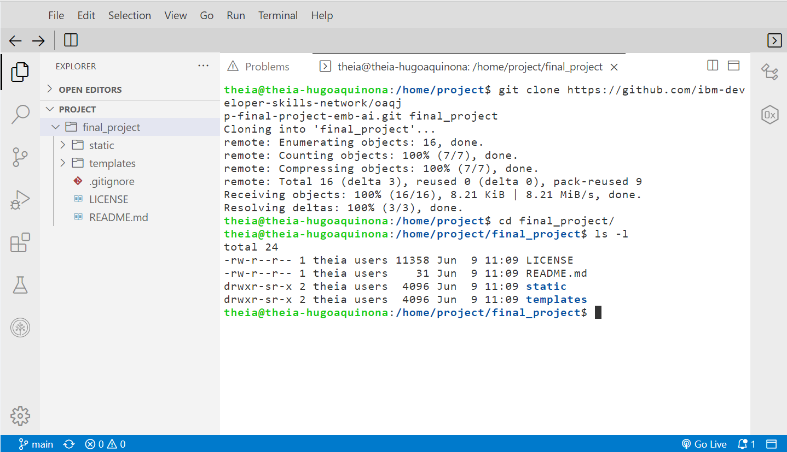

# Evidence requested for the course "IBM PY0222EN Python for AI & Development Project"

- [x] **Task1: Clone the project repository**
  - Repository folder structure 

- [x] **Task 2: Create an emotion detection application using Watson NLP library**
  - Write code for the application function

  - Import the application without errors

- [x] **Task 3: Format the output of the application**
  - Modify the emotion_predictor function accurately for it to return the provided output format

  - Check that the output format is accurate 

- [x] **Task 4: Package the application**
  - Create the folder structure for packaging the application and create the __init__.py file

  - Verify that the output is as expected

- [x] **Task 5: Run Unit tests on your application**
  - Create the required unit tests

  - Run user tests until all pass

- [x] **Task 6: Web deployment of the application using Flask**
  - Update server.py with the right contents

  - Deploy the application

- [x] **Task 7: Incorporate Error handling**
  - Update the emotion_detector function for status code, 400

  - Update the server.py file to manage blank input errors

  - Validate error handling functionality

- [x] **Task 8: Run static code analysis**
  - Update the server.py to highlight the code that gets 10/10

  - Get a perfect score for static code analysis
